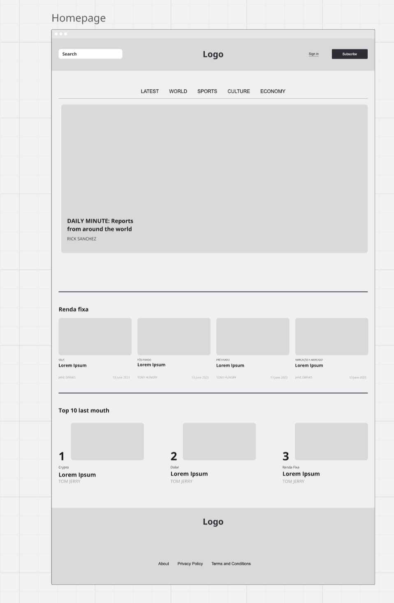
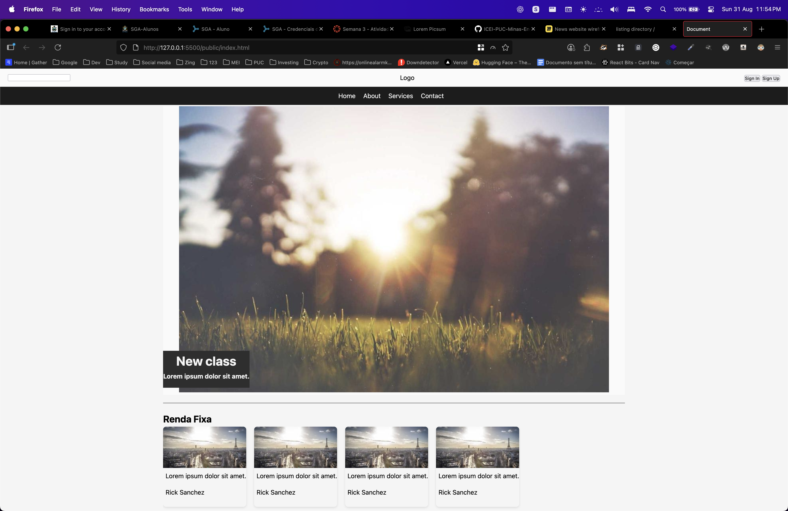
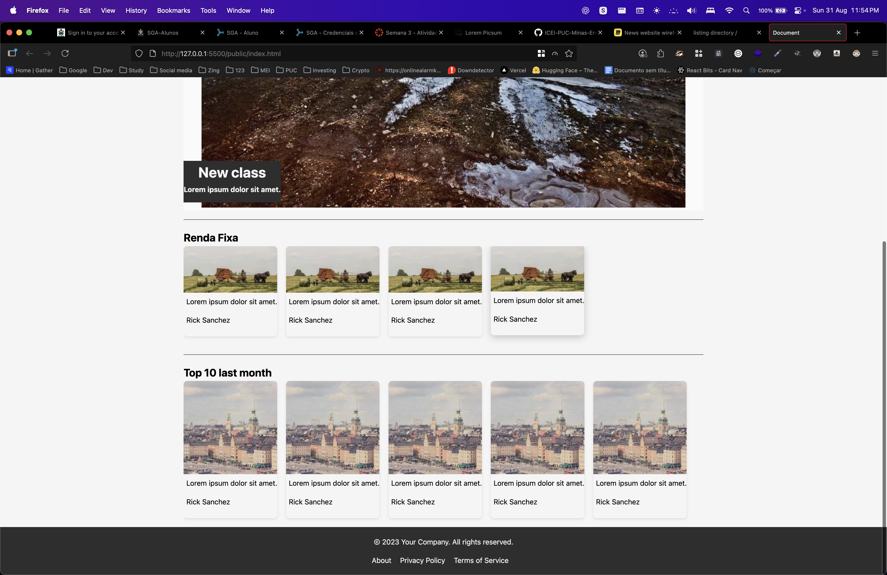

# Trabalho Prático - Semana 03

Dessa vez, vamos escolher uma proposta de projeto para trabalhar.

Nessa atividade, você deverá montar a página inicial do projeto escolhido, a organização do HTML aplicando semântica correta e uso aprimorado do CSS. Leia o enunciado completo no Canvas para mais detalhes.

**IMPORTANTE:** Você deve trabalhar e alterar apenas arquivos dentro da pasta **`public`**. Deixe todos os demais arquivos e pastas desse repositório inalterados. **PRESTE MUITA ATENÇÃO NISSO.**

## Informações Gerais

- Nome: Guilherme Henrique Moreira Costa
- Matricula: 855826
- Proposta de projeto escolhida: 5. Temas e Conteúdos Associados 	Tema 	Conteúdos / Recursos 	Tema e vídeos, curso e aulas, categoria e dicas
- Breve descrição sobre seu projeto: Projeto tem como idea ser a homepage de uma pagina de web de curso. Exibindo na home cursor em categoria através de sessoes com cards.

## Print do(s) wireframe(s) criado

## Print da home-page criada

